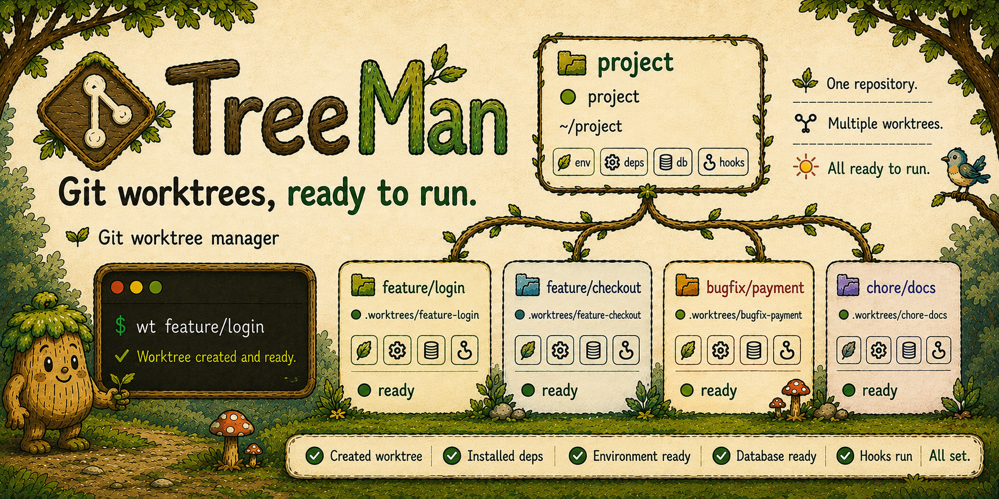

# TreeMan

Git worktrees, ready to run. 

Create isolated branches with their setup, dependencies, environment files, databases, and hooks already in place.

## Installation

Homebrew:

```bash
brew install shoutcape/tap/treeman
treeman shell install
```

`treeman shell install` detects Bash, Zsh, or Fish and adds the shell wrappers to the related shell startup file. Use `--shell` or `--config` to override detection.

Or install the latest release for Linux or macOS:

```bash
curl -fsSL https://raw.githubusercontent.com/shoutcape/TreeMan/main/install.sh | bash
```

The release installer supports Linux and macOS on amd64 and arm64. It installs TreeMan in `~/.treeman/bin`, adds it to `PATH`, and configures shell wrappers in your shell startup file.

Reload your shell after either installation method:

```bash
exec "$SHELL"
```

Read [installation details](docs/installation.md) for manual installation, source builds, requirements, removal, and Homebrew behavior.

## Why TreeMan

Git creates a separate directory for a branch with `git worktree add`. That directory can still need configuration, dependencies, generated files, a database, and later cleanup before you can run the project.

TreeMan keeps Git worktrees as the foundation. It can run the project setup that a new worktree needs, and adds workflows for remote branches, reviews, switching, and cleanup.

## Workflows

### Create Your First Worktree

```bash
wt feature/login
```

TreeMan fetches the default branch, creates `feature/login`, and creates its worktree at `.worktrees/feature-login` under the main worktree.

After creation, TreeMan performs these steps in order:

1. Tries to add `.worktrees/` to `.gitignore`.
2. Copies `.env*` files unless you use `--skip-env`.
3. Creates a PostgreSQL branch database when configured.
4. Installs project dependencies when it detects a supported project.
5. Runs configured post-create hooks.

Shell integration changes the current shell directory to the new worktree. Setup failures are warnings. The worktree remains available. Use the related `--skip-*` flag to omit an optional setup action.

### Supported Dependency Managers

TreeMan detects dependency setup from files at the repository root:

| Project marker | Command |
| --- | --- |
| `package.json` with `"packageManager": "yarn@<version>"` | `corepack yarn install` |
| `pnpm-lock.yaml` | `pnpm install` |
| `yarn.lock` | `yarn install` |
| `package-lock.json` | `npm install` |
| `go.mod` | `go mod download` |
| `Cargo.toml` | `cargo fetch` |

An explicit Yarn `packageManager` declaration takes priority over lockfiles and requires `corepack` on `PATH`. TreeMan invokes Corepack directly so the project selects its declared Yarn version; it never runs `corepack enable` or changes global package-manager configuration. A Yarn project without that declaration keeps the classic `yarn.lock` behavior and requires `yarn` on `PATH`.

### Nested Modules and Tests

Dependency setup checks only files in the worktree root. TreeMan does not recursively install dependencies for nested modules and does not run project tests automatically. This avoids unexpected commands in subdirectories. Use a trusted `hooks.post_create` command when a nested module needs installation or tests.

Run `treeman preflight` first to report environment, dependency, database, and hook setup compatibility without creating a worktree. It reports nested modules as skipped so monorepo setup can be added explicitly through trusted hooks.

### Use Remote Branches

Use `treeman branch` or `wtb` to add a remote branch worktree. With no query, TreeMan uses an interactive `fzf` picker. Give an exact remote branch name to skip the picker.

### Review Pull Requests and Merge Requests

Use `treeman review`, `wtpr`, or `wtmr` to add a review worktree. TreeMan detects GitHub or GitLab from `origin`. Give a review number, or select an open review with `fzf`.

### Switch Worktrees

Use `treeman switch` or `wts` to select a worktree. Shell integration changes the current shell directory to the selected worktree.

### Start Work in the New Worktree

`create`, `branch`, `review`, and `switch` accept `-x <command>`. TreeMan runs the command in the ready worktree instead of printing its path.

```bash
wt feature/login -x claude
wtpr 42 -x nvim
wts -x lazygit
```

The command replaces TreeMan, so it owns the terminal, it can be interactive, and it reports its own exit status. Your shell directory does not change. Read the [Command Reference](docs/reference/cli.md#run-a-command-in-the-worktree).

### Clean Finished Worktrees

Use `treeman clean` or `wtc` to remove clean worktrees whose branches are merged into the default branch. TreeMan can also recognize verified squash or rebase merges after the remote branch is deleted. It retains branches that it cannot verify.

> [!NOTE]
> TreeMan never removes the main worktree, the default branch, or detached worktrees during cleanup. `treeman delete` also refuses dirty worktrees, and branches whose commits are on no remote and not on the default branch, unless you explicitly use `--force`.

### Use TreeMan in Agents and Scripts

Native TreeMan commands never change the caller directory. Commands that create or select a worktree report its path, and shell integration uses that report to change the current interactive shell directory. Run TreeMan without shell integration and the path goes to stdout, so scripts and pipes keep working.

Use `-x <command>` to start an agent or an editor in the worktree that TreeMan just made ready. The command replaces TreeMan and receives the terminal.

Use `treeman list --json` for machine-readable worktree state and `treeman doctor` to check repository readiness and optional integrations.

## Command Reference

| Native command                      | Shell wrapper                    | Purpose                                      |
| ----------------------------------- | -------------------------------- | -------------------------------------------- |
| `treeman create <branch>`           | `wt <branch>`                    | Create a local branch and worktree           |
| `treeman branch [query]`            | `wtb [query]`                    | Add a remote branch worktree                 |
| `treeman review [number]`           | `wtpr [number]`, `wtmr [number]` | Add a pull request or merge request worktree |
| `treeman switch [query]`            | `wts [query]`                    | Select a worktree path                       |
| `treeman list [--json]`             | `wtl`                            | List worktrees and their state               |
| `treeman clean [--dry-run] [--yes]` | `wtc`                            | Remove clean, merged worktrees               |
| `treeman delete [query]`            | `wtd [query]`                    | Delete a linked worktree and branch          |
| `treeman shell`                     | None                             | Install and manage shell integration         |
| `treeman doctor`                    | None                             | Check repository readiness and configuration |
| `treeman preflight`                 | None                             | Report setup compatibility before creation   |
| `treeman theme`                     | None                             | Select a terminal color theme                |
| `treeman version`                   | None                             | Print build data                             |

Shell integration uses paths printed by native commands to change the current shell directory.

Read [Getting Started](docs/getting-started.md) and the [Command Reference](docs/reference/cli.md) for flags, direct commands, and safety rules.

## Agents

Install the TreeMan Agent Skill for OpenCode, Claude Code, Codex, and other supported agents:

```bash
npx skills add shoutcape/TreeMan --skill treeman -g -a opencode
```

Read [Use TreeMan with agents](docs/integrations/agents.md) for installation and safety rules.

## Usage Examples

### Switch Worktrees

https://github.com/user-attachments/assets/88dce115-2ae6-4c43-9458-5651e8e4fd54

### Create a Worktree

https://github.com/user-attachments/assets/c0c472d1-f952-4a32-84ad-49cc0fbffa19

### Add a Remote Branch Worktree

https://github.com/user-attachments/assets/fc675dd8-3edc-4bc3-8880-f965e666e21b

### Review a Pull Request

https://github.com/user-attachments/assets/ce8a7196-e098-4f7d-a575-4f6bdf9899be

## Documentation

- [Documentation index](docs/README.md)
- [Workflows](docs/guides/workflows.md)
- [Configuration](docs/reference/configuration.md)
- [GitHub and GitLab](docs/integrations/github-gitlab.md)
- [Agents](docs/integrations/agents.md)
- [PostgreSQL branch databases](docs/integrations/postgresql.md)
- [Troubleshooting](docs/operations/troubleshooting.md)
- [Known limitations](docs/known-limitations.md)
- [Architecture](docs/architecture/overview.md)
- [Development](docs/development/setup.md)

## License

TreeMan is available under the [MIT License](LICENSE).

## Documentation Standard

Project documentation uses ASD-STE100 Simplified Technical English, Issue 9, as its writing standard. Read [writing controls](docs/writing-standard.md).
