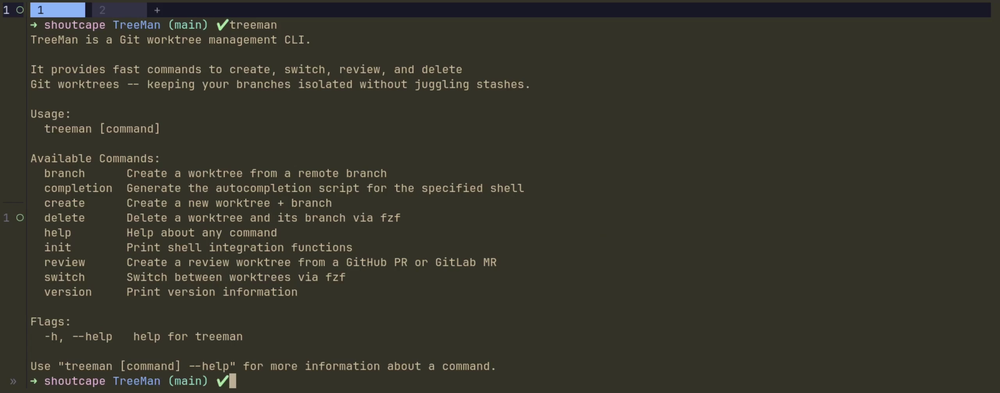

# TreeMan

TreeMan creates runnable, isolated Git worktrees for developers and coding agents. It copies environment files, installs dependencies, runs hooks, and can create a branch-specific PostgreSQL database.

TreeMan has one compiled binary. Shell wrappers support Bash, Zsh, and Fish.

## Install

```bash
curl -fsSL https://raw.githubusercontent.com/shoutcape/TreeMan/main/install.sh | bash
```

Restart the shell after installation.

```bash
exec "$SHELL"
```

To install the version from the current local worktree instead of a release:

```bash
./install-local.sh
```

Read [installation details](docs/installation.md) for manual installation, source builds, requirements, and removal.

## Start

```bash
wt feature/login
wtb
wtpr 42
wts
wtd
wtc
```

| Wrapper | Native command | Purpose |
| --- | --- | --- |
| `wt <branch>` | `treeman create <branch>` | Create a local branch worktree |
| `wtb [query]` | `treeman branch [query]` | Add a remote branch worktree |
| `wtpr [number]` | `treeman review [number]` | Add a review worktree |
| `wtmr [number]` | `treeman review [number]` | Add a review worktree |
| `wts [query]` | `treeman switch [query]` | Change shell directory to a worktree |
| `wtl` | `treeman list [--json]` | List worktrees and their state |
| `wtc` | `treeman clean [--dry-run] [--yes]` | Remove clean worktrees merged into the default branch |
| `wtd [query]` | `treeman delete [query]` | Delete a worktree and branch |

Read [Getting Started](docs/getting-started.md) and the [Command Reference](docs/reference/cli.md).

## Agents

TreeMan has an Agent Skill for OpenCode, Claude Code, Codex, and other supported agents.

```bash
npx skills add shoutcape/TreeMan --skill treeman -g -a opencode
```

Read [Use TreeMan with agents](docs/integrations/agents.md) for installation and safety rules.

## Usage Examples

### Terminal integration



### Switch worktrees

https://github.com/user-attachments/assets/88dce115-2ae6-4c43-9458-5651e8e4fd54

### Create a worktree

https://github.com/user-attachments/assets/c0c472d1-f952-4a32-84ad-49cc0fbffa19

### Add a remote branch worktree

https://github.com/user-attachments/assets/fc675dd8-3edc-4bc3-8880-f965e666e21b

### Review a pull request

https://github.com/user-attachments/assets/ce8a7196-e098-4f7d-a575-4f6bdf9899be

> [!note]
> Deletion completes before TreeMan returns. TreeMan refuses dirty worktrees and unmerged branches unless you explicitly use `--force`.

`wtc` fetches the default branch, then removes linked worktrees when their branch is merged into it and the worktree is clean. Squash- and rebase-merged branches also qualify: TreeMan checks each remote-gone candidate through `gh` or `glab`, with at most four checks running at once, then removes a branch only when its tip still matches the matching source head commit. This includes GitHub fork PRs. If it removes the current worktree, it returns the shell to the main worktree. Use `wtc --dry-run` to inspect candidates first. Use `wtc --yes` to skip confirmation.

## Documentation

- [Documentation index](docs/README.md)
- [Workflows](docs/guides/workflows.md)
- [Configuration](docs/reference/configuration.md)
- [GitHub and GitLab](docs/integrations/github-gitlab.md)
- [Agents](docs/integrations/agents.md)
- [PostgreSQL branch databases](docs/integrations/postgresql.md)
- [Troubleshooting](docs/operations/troubleshooting.md)
- [Known limitations](docs/known-limitations.md)
- [Architecture](docs/architecture/overview.md)
- [Development](docs/development/setup.md)

## Documentation Standard

Project documentation uses ASD-STE100 Simplified Technical English, Issue 9, as its writing standard. Read [writing controls](docs/writing-standard.md).
