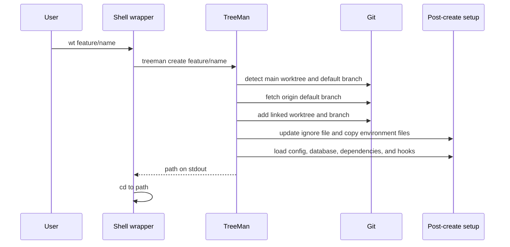
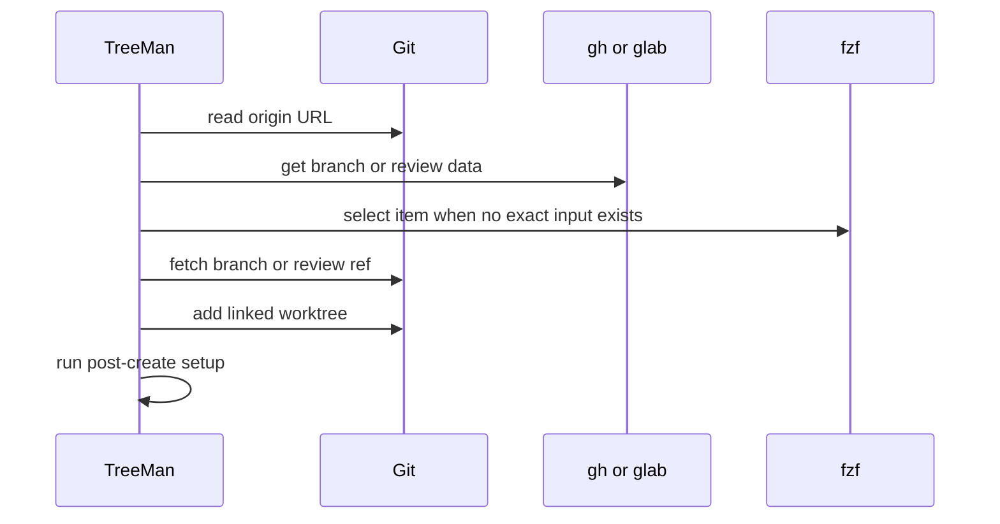
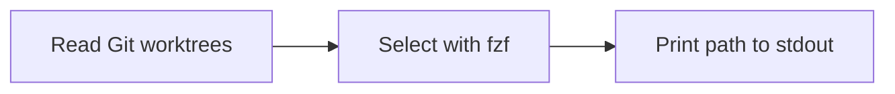

# Command Lifecycles

## Create



## Remote Branch and Review



## Switch



## Delete

```mermaid
sequenceDiagram
    participant TreeMan
    participant Git
    participant DB as Branch database
    TreeMan->>Git: verify linked worktree and branch
    TreeMan->>TreeMan: protect main and default branch; inspect dirty state
    TreeMan->>DB: try database cleanup
    TreeMan->>Git: worktree remove
    TreeMan->>Git: branch -d
    TreeMan-->>TreeMan: return success or error
```

TreeMan reads the environment file before Git removes the worktree. `--force` permits deletion of dirty worktrees and unmerged branches.
