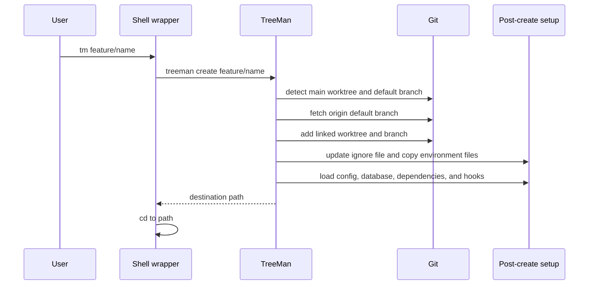
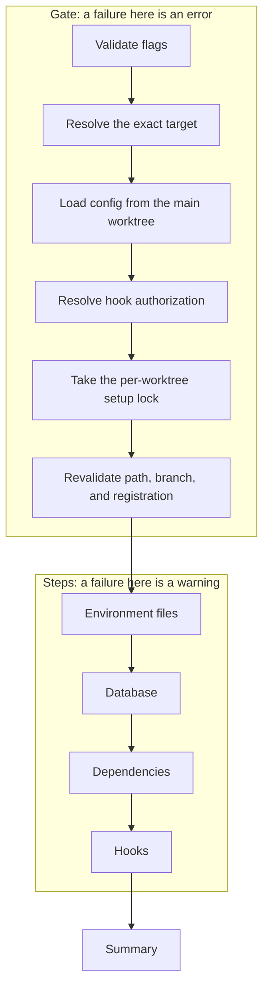
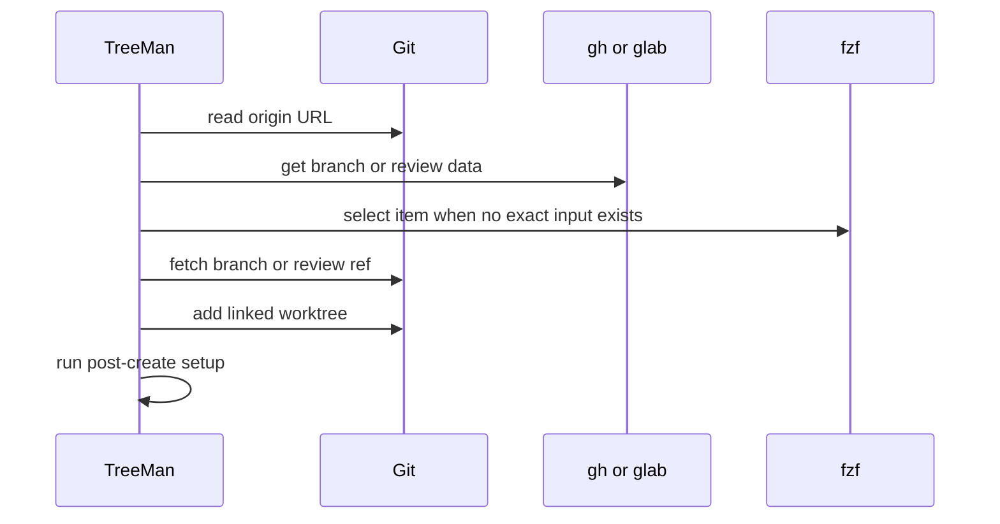
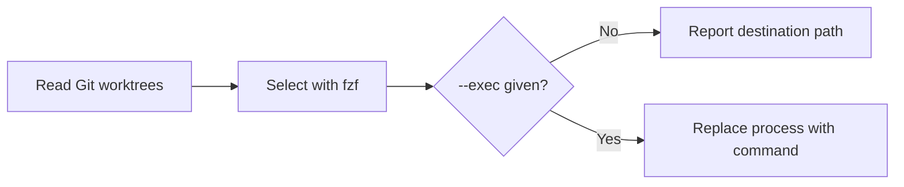

# Command Lifecycles

## Create



With `--exec`, TreeMan replaces its own process with the command after setup. It reports no destination, so the shell wrapper does not change directory.

## Setup

`treeman setup` repairs a worktree that exists. The gate stops the run before
any step changes a file. After the gate, each step is warning-only.



TreeMan holds the lock across the environment, database, dependency, and hook
steps. It resolves hook approval before the lock, therefore a consent prompt
never waits with the lock held.

## Remote Branch and Review



## Switch



## Delete

```mermaid
sequenceDiagram
    participant TreeMan
    participant Git
    participant DB as Branch database
    TreeMan->>Git: verify linked worktree and branch
    TreeMan->>TreeMan: protect main and default branch; inspect dirty state
    TreeMan->>DB: load durable ownership record
    TreeMan->>TreeMan: stage directory in Git common-dir treeman/trash
    TreeMan->>TreeMan: validate captured directory identity and contents
    TreeMan->>Git: worktree remove
    TreeMan->>TreeMan: asynchronously unlink staged directory
    TreeMan->>Git: compare-and-delete branch at verified SHA
    TreeMan->>DB: mark pending and try database cleanup
    TreeMan-->>TreeMan: return success or error
```

TreeMan records database ownership before setup completes and reads that durable record before Git removes the worktree. It stages a removable directory under `treeman/trash` in the repository's Git common directory, validates the captured directory, then unregisters the worktree. It queues asynchronous unlinking before compare-and-deleting the branch. A successful Git deletion can therefore precede filesystem cleanup; queued cleanup is retried only by a later removal. If a staged directory cannot be restored after validation or unregistration fails, TreeMan reports its staged location for manual recovery. A subsequent branch-deletion failure instead preserves the branch but does not restore the removed worktree.

TreeMan drops the database only after worktree and branch deletion succeed, retaining a pending record for retry if Docker cleanup fails. Branch deletion compares the current ref with the SHA that passed deletion checks. Planning and execution share registration and branch validation, with execution checking fresh state under the repository mutation lock. TreeMan serializes its own worktree additions and guarded deletions, preserving a branch that another TreeMan process checks out before deletion. Direct Git worktree mutation is not coordinated. `--force` permits deletion of dirty worktrees and of branches whose commits no remote-tracking ref and not the default branch can reach.

## List and Clean

`list` and `clean` capture local branch tips before they read fresh remote merge state. GitHub uses one complete GraphQL snapshot per bounded batch. The snapshot contains the default ref, candidate refs, and PR evidence. Candidates with incomplete data use exact-SHA REST verification. This occurs only after stable remote-gone and non-ancestor checks. A snapshot that reports no exact head match is compared with local history in both directions: a tip reachable from a merged head is fully merged and cleanable, while a tip that reaches a merged head is merged for display only. A failed snapshot records a diagnostic. TreeMan then uses fresh Git state and bounded REST verification. GitLab batches deleted-branch merge verification. Other remotes use Git and bounded forge verification.

TreeMan fetches the default branch only when its tracking ref is stale. GitHub requests over the batch limit are not globally atomic. TreeMan verifies that the default branch SHA remains stable between batches. `clean` repeats classification after confirmation, including with `--yes`. It deletes only matching branch tips.
