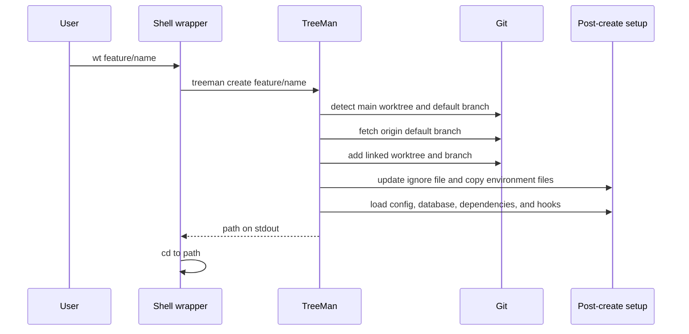
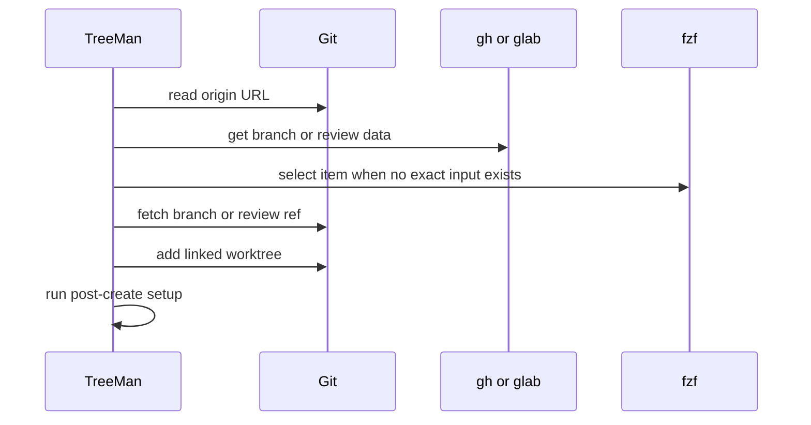
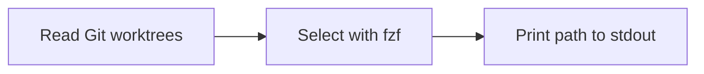

# Command Lifecycles

## Create



## Remote Branch and Review



## Switch



## Delete

```mermaid
sequenceDiagram
    participant TreeMan
    participant Git
    participant DB as Branch database
    TreeMan->>Git: verify linked worktree and branch
    TreeMan->>TreeMan: protect main and default branch; inspect dirty state
    TreeMan->>DB: load durable ownership record
    TreeMan->>Git: worktree remove
    TreeMan->>Git: compare-and-delete branch at verified SHA
    TreeMan->>DB: mark pending and try database cleanup
    TreeMan-->>TreeMan: return success or error
```

TreeMan records database ownership before setup completes and reads that durable record before Git removes the worktree. It drops the database only after worktree and branch deletion succeed, retaining a pending record for retry if Docker cleanup fails. Branch deletion compares the current ref with the SHA that passed deletion checks. TreeMan serializes its own worktree additions and guarded deletions, preserving a branch that another TreeMan process checks out before deletion. Direct Git worktree mutation is not coordinated. `--force` permits deletion of dirty worktrees and unmerged branches.

## List and Clean

`list` and `clean` capture local branch tips before they read fresh remote merge state. GitHub uses one complete GraphQL snapshot per bounded batch. The snapshot contains the default ref, candidate refs, and PR evidence. Candidates with incomplete data use exact-SHA REST verification. This occurs only after stable remote-gone and non-ancestor checks. A failed snapshot records a diagnostic. TreeMan then uses fresh Git state and bounded REST verification. GitLab batches deleted-branch merge verification. Other remotes use Git and bounded forge verification.

TreeMan fetches the default branch only when its tracking ref is stale. GitHub requests over the batch limit are not globally atomic. TreeMan verifies that the default branch SHA remains stable between batches. `clean` repeats classification after confirmation, including with `--yes`. It deletes only matching branch tips.
