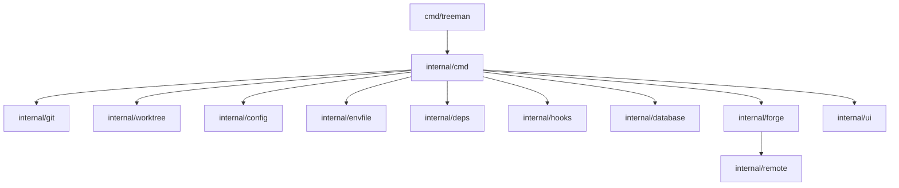

# Architecture Overview

TreeMan is a single-process command-line program. It has no server and no persistent application database.

The `cmd/treeman` program creates the Cobra root command. `internal/cmd` coordinates each user command. Small internal packages perform Git, configuration, file, forge, database, and user-interface actions.

## State Ownership

| State | Owner |
| --- | --- |
| Branches and worktree records | Git |
| Worktree directories | Git and file system |
| `.worktrees/` ignore entry | Main worktree `.gitignore` |
| Environment files | Main and linked worktrees |
| Project configuration | `.treeman.toml` |
| Branch databases | Docker PostgreSQL |
| Deferred delete failures | Delete error log |

## Failure Boundaries

TreeMan stops commands for input errors, repository errors, required tool errors, Git creation errors, and forge API errors.

TreeMan reports warnings and continues for `.gitignore` updates, environment copies, database actions, dependency installs, hooks, and upstream setup.

Deletion is different. The parent command starts a detached child. The child writes later errors to the delete error log.

## External Programs

TreeMan runs `git`, `fzf`, `gh`, `glab`, `jq`, package managers, Docker, and `psql` when their related feature runs.

Hooks run configured shell text. Treat project configuration as executable input.
